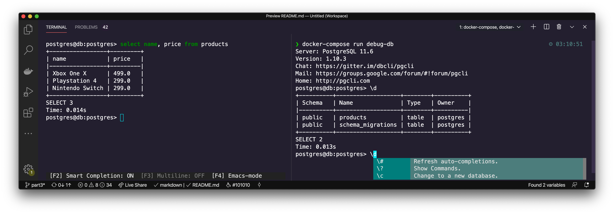

# DevPie Client Backend

### Usage

1 - Copy .env.sample and rename it to .env

Include the necessary `API_WEB_*` secrets from Auth0.

```bash
# USAGE WITH ENV VARS
# 1. env $(cat .env | grep -v "#" | xargs)
# 2. go run ./cmd/api

API_WEB_AUTH_DOMAIN=
API_WEB_AUTH_AUDIENCE=
API_WEB_AUTH_MAPI_AUDIENCE=
API_WEB_AUTH_M_2_M_CLIENT=
API_WEB_AUTH_M_2_M_SECRET=

API_PORT=4000
PPROF_PORT=6060
CLIENT_PORT=3000

REACT_APP_BACKEND=https://localhost:4000/v1
API_WEB_FRONTEND_ADDRESS=https://localhost:3000

DB_URL=postgres://postgres:postgres@db:5432/postgres?sslmode=disable
```

2 - Unblock port 5432 for postgres

3 - Create self-signed certificates


```makefile
mkdir -p ./tls
go run $(go env GOROOT)/src/crypto/tls/generate_cert.go --rsa-bits=2048 --host=localhost
mv *.pem ./tls
```

4 - Setup up the Postgres container

Run the database in the background.

```makefile
docker-compose up -d db
```

#### Run the API container with live reload enabled

```
docker-compose up api
```

### Migration Workflow

Imagine an API that serves products. 

#### Make a migration to create the products table

```makefile
docker-compose run migration create_products_table
```

Add sql to both `up` & `down` migrations files found at: `./internal/schema/migrations/`.

**Up**

```sql
-- 000001_create_products_table.up.sql

CREATE TABLE products (
    id UUID not null unique,
    name varchar(100) not null,
    price real not null,
    description varchar(100) not null,
    created timestamp without time zone default (now() at time zone 'utc')
);
```

**Down**

```sql
-- 000001_create_products_table.down.sql

DROP TABLE IF EXISTS products;
```

#### Creating a second migration

Make another migration to add tags to products:

```
docker-compose run migration add_tags_to_products
```

**Up**

```sql

-- 000002_add_tags_to_products.up.sql

ALTER TABLE products
ADD COLUMN tags varchar(255);
```

**Down**

```sql
-- 000002_add_tags_to_products.down.sql

ALTER TABLE products
DROP Column tags;
```

Migrate up to the latest migration

```makefile
docker-compose run up # you can migrate down with "docker-compose run down"
```

Display which version you have selected. Expect it two print `2` since you created 2 migrations.

```makefile
docker-compose run version
```

[Learn more about my go-migrate Postgres helper](https://github.com/ivorscott/go-migrate-postgres-helper)

### Seeding the database (optional)

Create a seed file of the appropriate name matching the table name you wish to seed.

For example:

```makefile
touch ./internal/schema/seeds/products.sql
```

This adds an empty products.sql seed file found under `./internal/schema/seeds`. Add the following sql content:

```sql
-- ./internal/schema/seeds/products.sql

INSERT INTO products (id, name, price, description, created) VALUES
('cbef5139-323f-48b8-b911-dc9be7d0bc07','Xbox One X', 499.00, 'Eighth-generation home video game console developed by Microsoft.','2019-01-01 00:00:01.000001+00'),
('ce93a886-3a0e-456b-b7f5-8652d2de1e8f','Playstation 4', 299.00, 'Eighth-generation home video game console developed by Sony Interactive Entertainment.','2019-01-01 00:00:01.000001+00'),
('faa25b57-7031-4b37-8a89-de013418deb0','Nintendo Switch', 299.00, 'Hybrid console that can be used as a stationary and portable device developed by Nintendo.','2019-01-01 00:00:01.000001+00')
ON CONFLICT DO NOTHING;
```

Conflicts may arise when you execute the seed file more than once to the database. Appending "ON CONFLICT DO NOTHING;" to the end prevents this. This functionality depends on at least one table column having a unique constraint. In our case id is unique.

Finally, add the products seed to the database.

```
docker-compose exec db psql postgres postgres -f /seed/products.sql
```

Enter the database and examine its state.

```makefile
docker-compose run debug-db
```



If the database container is removed, you don't need to start from scratch. A named volume was created to persist the data. Simply run the container in the background again.

##** Warning **

To replicate the production environment as much as possible locally, we use self-signed certificates.

In your browser, you may see a warning and need to click a link to proceed to the requested page. This is common when using self-signed certificates.

## Idiomatic Go Development (without a container)

Another approach is to containerize only the database. Work with the API in an idiomatic fashion. This means without a container and with live reloading `disabled`. To configure the API, use command line flags or export environment variables.

```makefile
# USING ENV VARS
# export env $(cat .env | grep -v "#" | xargs)
# go run ./cmd/api

# USING FLAGS
# go run ./cmd/api --db-disable-tls=true --web-auth-domain=<INSERT-VALUE-HERE> --web-auth-audience=<INSERT-VALUE-HERE> --web-auth-m-2-m-client=<INSERT-VALUE-HERE> --web-auth-m-2-m-secret=<INSERT-VALUE-HERE> --web-auth-mapi-audience=<INSERT-VALUE-HERE>
```
#### Development Commands

```makefile
docker-compose up api # develop api with live reload

docker-compose up -d db # start the database in the background

docker-compose run debug-db # use pgcli to inspect postgres db

docker-compose run migration <name> # create a migration

docker-compose run version # print current migration version

docker-compose run up <number> # migrate up a number (optional number, defaults to latest migration)

docker-compose run down <number> # migrate down a number (optional number, defaults to 1)

docker-compose run force <version> # Set version but don't run migration (ignores dirty state)

docker-compose exec db psql postgres postgres -f /seed/<name>.sql  # insert seed file to database
```
#### Build and Deploy Steps (in order)
```
make build # build production ready image

make login # login to Docker Hub

make publish # publish to Docker Hub

make metrics # enable Docker engine metrics

make secrets # create Docker swarm secrets

make server # create digital ocean server

make swarm # create single node Swarm cluster

make deploy # perform "docker stack deploy"
```